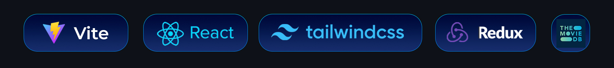

# Disney+ Hotstar Clone

<p align="center">


</p>

<p align="center">
Building Project with Vite, ReactJs, TailwindCSS, Redux and using The MovieDB API
</p>



## <a name="quick-start">🤸 Quick Start</a>

Follow these steps to set up the project locally on your machine.

**Installation**

Install the project dependencies using npm:

```bash
npm install
```

**Running the Project**

```bash
npm run dev
```

Open [http://localhost:5173](http://localhost:5173) in your browser to view the project.

## Demo Application

[Disney+ Hotstar Clone](https://disney-hotstar-clone-gilt.vercel.app/)

## Development

### [ log -> 23-03-2024]

1. Minimum Landing Page
2. Home Page (Responsive)

### [log -> 24-03-2024]

1. Search Movie
